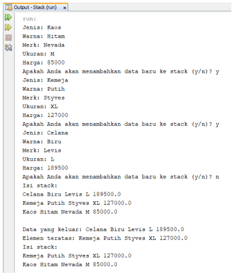
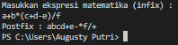
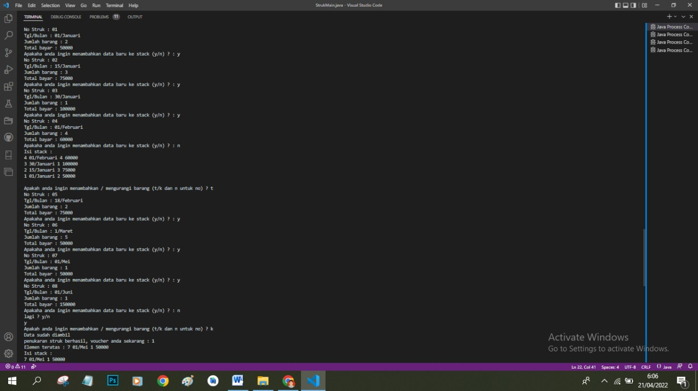

## **
Jobsheet 7 (Stack)
**

>
Nama : Bagus Dwi Putranto

>Kelas : 1F D4 TI

>Nomer Absen : 08

>NIM : 2141720079

 

### 7.1 Tujuan Praktikum
Setelah melakukan materi praktikum ini, mahasiswa mampu:
1. Mengenal struktur data Stack
2. Membuat dan mendeklarasikan struktur data Stack
3. Menerapkan algoritma Stack dengan menggunakan array

### 7.2 Praktikum 1
Waktu percobaan : 45 menit
Pada percobaan ini, kita akan membuat program yang mengilustrasikan tumpukan pakaian yang 
disimpan ke dalam stack. Karena sebuah pakaian mempunyai beberapa informasi, maka implementasi 
Stack dilakukan dengan menggunakan array of object untuk mewakili setiap elemennya.

### 7.2.1 Langkah-langkah Percobaan
1. Perhatikan Diagram Class Pakaian berikut ini:

2. Buat package dengan nama Praktikum1, kemudian buat class baru dengan nama Pakaian.

3. Tambahkan atribut-atribut Pakaian seperti pada Class Diagram Pakaian, kemudian tambahkan 
pula konstruktornya seperti gambar berikut ini.

4. Setelah membuat class Pakaian, selanjutnya perlu dibuat class Stack yang berisi atribut dan 
method sesuai diagram Class Stack berikut ini: 

5. Buat class baru dengan nama Stack. Kemudian tambahkan atribut dan konstruktor seperti 
gambar berikut ini.

6. Buat method IsEmpty bertipe boolean yang digunakan untuk mengecek apakah stack kosong.

7. Buat method IsFull bertipe boolean yang digunakan untuk mengecek apakah stack sudah terisi 
penuh.

8. Buat method push bertipe void untuk menambahkan isi elemen stack dengan parameter pkn
yang berupa object Pakaian

9. Buat method Pop bertipe void untuk mengeluarkan isi elemen stack. Karena satu elemen stack
terdiri dari beberapa informasi (jenis, warna, merk, ukuran, dan harga), maka ketika mencetak 
data juga perlu ditampilkan semua informasi tersebut

10. Buat method peek bertipe void untuk memeriksa elemen stack pada posisi paling atas.

11. Buat method print bertipe void untuk menampilkan seluruh elemen pada stack.

12. Buat method clear bertipe void untuk menghapus seluruh isi stack.

13. Selanjutnya, buat class baru dengan nama StackMain. Buat fungsi main, kemudian lakukan 
instansiasi objek dari class Stack dengan nama stk dan nilai parameternya adalah 5.

14. Deklarasikan Scanner dengan nama sc

15. Tambahkan kode berikut ini untuk menerima input data Pakaian, kemudian semua informasi 
tersebut dimasukkan ke dalam stack

16. Lakukan pemanggilan method print, method pop, dan method peek dengan urutan sebagai 
berikut.

17. Compile dan jalankan class StackMain, kemudian amati hasilnya.

### 7.2.2 Verifikasi Hasil Percobaan

### 7.2.3 Pertanyaan
1. Berapa banyak data pakaian yang dapat ditampung di dalam stack? Tunjukkan potongan kode program untuk mendukung jawaban Anda tersebut!

>Jawab : **yang dapat ditampung  di dalam stack adalah sebanyak 5 data, karena Stack stk = new Stack(5);**

2. Perhatikan class StackMain, pada saat memanggil fungsi push, parameter yang dikirimkan adalah p. Data apa yang tersimpan pada variabel p tersebut?

>Jawab : **Data yang tersimpan pada variable p yang ada pada parameter fungsi push  pkn, yang mana pkn adalah variable dari class Pakaian, dan data sebagai variable array dari class Pakaian yang mana data[top] = pkn; code tersebut berarti bawha indeks pada data yang ke "top" = pkn, jadi pkn/p berisikan nilai indeks ke top/data[top].**

3. Apakah fungsi penggunaan do-while yang terdapat pada class StackMain?

>Jawab : **Fungsi do-while adalah melakukan perulangan untuk menanyakan kepada user apakah user ingin menambahkan nilai pada stack, yang mana akan keluar dari perulangan tersebut jika user menjawab selain 'y'**

4. Modifikasi kode program pada class StackMain sehingga pengguna dapat memilih operasi - operasi pada stack (push, pop, peek, atau print) melalui pilihan menu program dengan memanfaatkan kondisi IF-ELSE atau SWITCH-CASE! 

>Jawab : 

### 7.3 Praktikum 2
Waktu percobaan : 30 menit
Pada percobaan ini, kita akan membuat program untuk melakukan konversi notasi infix menjadi notasi postfix.

### 7.3.1 Langkah-langkah Percobaan
1. Perhatikan Diagram Class berikut ini:

2. Buat package dengan nama Praktikum2, kemudian buat class baru dengan nama Postfix. Tambahkan atribut n, top, dan stack sesuai diagram class Postfix tersebut.

3. Tambahkan pula konstruktor berparameter seperti gambar berikut ini

4. Buat method push dan pop bertipe void.

5. Buat method IsOperand dengan tipe boolean yang digunakan untuk mengecek apakah elemen data berupa operand.

6. Buat method IsOperator dengan tipe boolean yang digunakan untuk mengecek apakah elemen data berupa operator.

7. Buat method derajat yang mempunyai nilai kembalian integer untuk menentukan derajat operator.

8. Buat method konversi untuk melakukan konversi notasi infix menjadi notasi postfix dengan cara mengecek satu persatu elemen data pada String Q sebagai parameter masukan.

9. Selanjutnya, buat class baru dengan nama PostfixMain tetap pada package Praktikum2. Buat class main, kemudian buat variabel P dan Q. Variabel P digunakan untuk menyimpan hasil akhir notasi postfix setelah dikonversi, sedangkan variabel Q digunakan untuk menyimpan masukan dari pengguna berupa ekspresi matematika dengan notasi infix. Deklarasikan variabel Scanner dengan nama sc, kemudian panggil fungsi built-in trim yang digunakan untuk menghapus adanya spasi di depan atau di belakang teks dari teks persamaan yang dimasukkan oleh pengguna.

10. Buat variabel total untuk menghitung banyaknya karaketer pada variabel Q

11. Lakukan instansiasi objek dengan nama post dan nilai parameternya adalah total. Kemudian panggil method konversi untuk melakukan konversi notasi infix Q menjadi notasi postfix P.

12. Compile dan jalankan class PostfixMain dan amati hasilnya.

### 7.3.2 Verifikasi Hasil Percobaan

1. Perhatikan class Postfix, jelaskan alur kerja method derajat!
>jawab : untuk memberi nilai pada setiap operator

2. Apa fungsi kode program berikut?

>jawab : untuk mengidentifikasi character pada indeks string ke i

3. Jalankan kembali program tersebut, masukkan ekspresi 3*5^(8-6)%3. Tampilkan hasilnya!
>jawab : 

4. Pada soal nomor 3, mengapa tanda kurung tidak ditampilkan pada hasil konversi? Jelaskan!
>jawab : Karena pada method konversi jika operator '(' maka akan dilewatin dengan cara memanggil method push(c), kemudian jika operator ')' dihilangkan dengan algoritma p = p + pop()

### 7.4 Tugas
1. Perhatikan dan gunakan kembali kode program pada Praktikum 1. Tambahkan method getMinpada class Stack yang digunakan untuk mencari dan menampilkan data pakaian dengan harga terendah dari semua data pakaian yang tersimpan di dalam stack!

2. Setiap hari Minggu, Dewi pergi berbelanja ke salah satu supermarket yang berada di area rumahnya. Setiap kali selesai berbelanja, Dewi menyimpan struk belanjaannya di dalam laci. Setelah dua bulan, ternyata Dewi sudah mempunyai delapan struk belanja. Dewi berencana mengambil lima struk belanja untuk ditukarkan dengan voucher belanja.Buat sebuah program stack untuk menyimpan data struk belanja Dewi, kemudian lakukan juga 
proses pengambilan data struk belanja sesuai dengan jumlah struk yang akan ditukarkan dengan voucher. Informasi yang tersimpan pada struk belanja terdiri dari:
 Nomor transaksi
 Tanggal pembelian
 Jumlah barang yang dibeli
 Total harga bayar
Tampilkan informasi struk belanja yang masih tersimpan di dalam stack!
>jawab :

